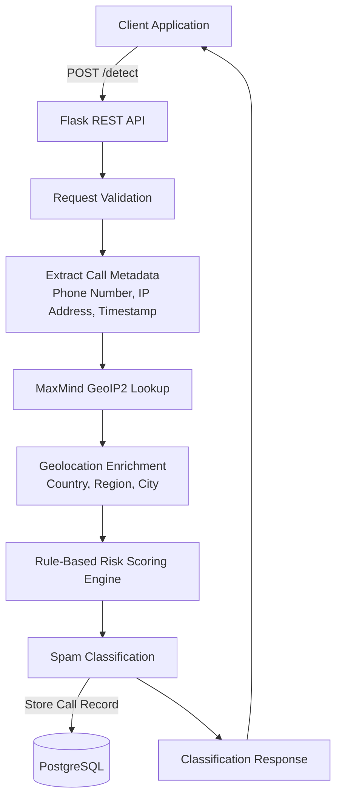

# Real-Time Spam Call Detection System

A real-time backend system that detects and classifies spam calls using geolocation-based risk signals and rule-based scoring. The system processes incoming call data, enriches it with origin information using MaxMind GeoIP2, classifies calls in real time, and stores results for historical analysis and auditing.

---

## Features

* Real-time spam call detection with an average end-to-end latency of **~400ms**
* Geolocation enrichment using **MaxMind GeoIP2**
* Rule-based spam classification engine with **90% precision**
* Persistent storage of call metadata and classification results in **PostgreSQL**
* Historical analysis and auditability of detected spam calls
* Load tested with **k6**, supporting **150 concurrent users** without performance degradation
* RESTful API built with **Flask**

---

## Architecture



## Tech Stack

| Category            | Technologies                                    |
| ------------------- | ----------------------------------------------- |
| Language            | Python                                          |
| Framework           | Flask                                           |
| Geolocation         | MaxMind GeoIP2                                  |
| Database            | PostgreSQL                                      |
| Performance Testing | k6                                              |
| Architecture        | Real-Time Processing, Rule-Based Classification |

---

## Performance Metrics

* **End-to-End Latency:** ~400ms
* **Classification Precision:** 90%
* **Concurrent Users Supported:** 150+
* **Response Stability:** No significant degradation under sustained load

---

## API Workflow

### 1. Receive Call Data

The client sends call metadata, including:

* Phone Number
* Caller IP Address
* Timestamp
* Optional Call Metadata

### 2. Geolocation Enrichment

The system uses MaxMind GeoIP2 to determine:

* Country
* Region
* City
* Origin-based risk indicators

### 3. Risk Scoring

A rule engine evaluates various factors:

* Geographical origin
* Suspicious calling patterns
* High-risk regions
* Historical indicators

### 4. Classification

The request is classified as:

* Spam
* Potential Spam
* Legitimate

### 5. Persistence

Call details and classification results are stored in PostgreSQL for:

* Historical analysis
* Reporting
* Auditing
* Future model improvements

---

## Example API Request

```json
POST /api/v1/detect

{
  "phone_number": "+919876543210",
  "ip_address": "203.0.113.10",
  "timestamp": "2026-06-20T10:30:00Z"
}
```

## Example API Response

```json
{
  "classification": "SPAM",
  "risk_score": 88,
  "country": "Unknown",
  "city": "Unknown",
  "processing_time_ms": 387
}
```

---

## Load Testing

Performance tests were conducted using **k6** to validate:

* Concurrent request handling
* Response latency
* Throughput stability
* System reliability under sustained load

Example:

```bash
k6 run load_test.js
```

---

## Future Improvements

* Machine Learning-based spam prediction models
* Redis caching for frequently queried geolocation data
* Containerization with Docker
* Real-time monitoring and observability dashboards
* WebSocket-based alerting and notifications

---

## Author

**Ayush Bhattacharjee**
